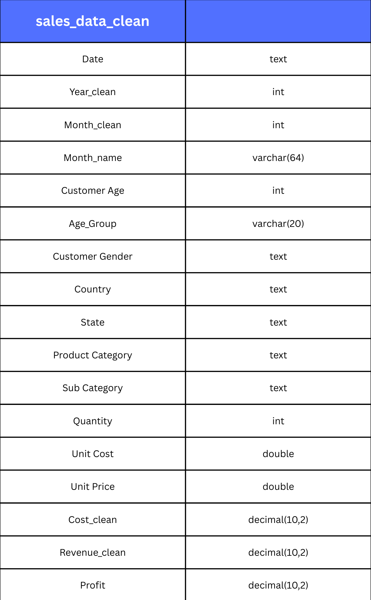
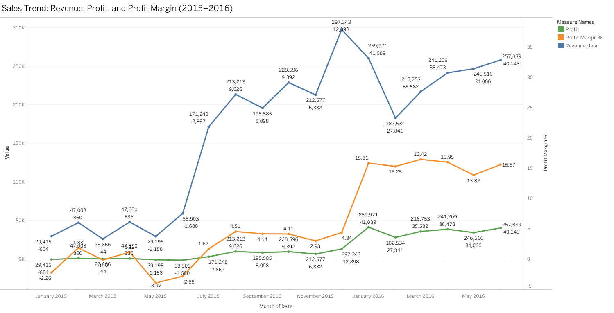
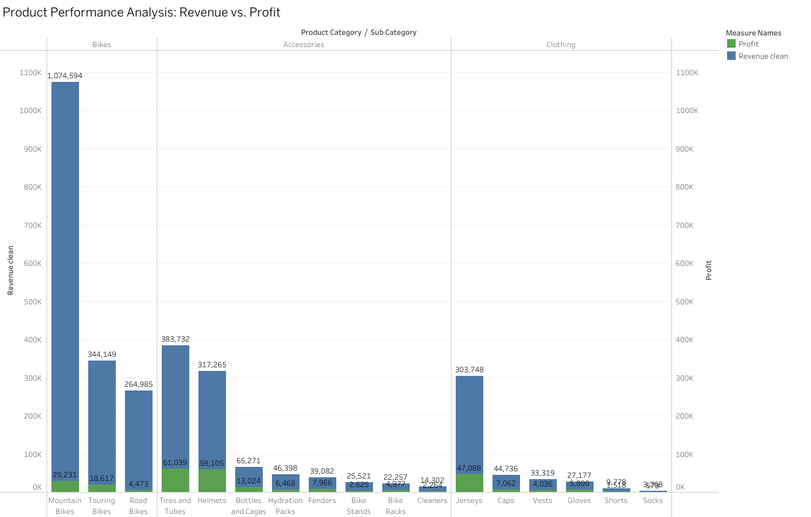
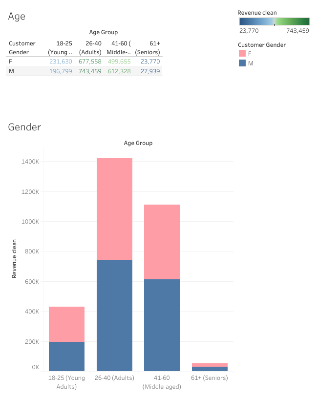

# Project Background
TrailBlaze Cycles, established in 2010, is a specialty retailer in the cycling industry that sells bicycles, accessories, and cycling apparel through both physical stores and its growing e-commerce platform. 
With over 15 years of active operations, the company has expanded across the United States, catering to both casual riders and professional cycling enthusiasts.

TrailBlaze has accumulated significant amounts of data on sales, customer demographics, product categories, and seasonal demand. 
However, much of this data has been underutilized. This project aims to analyze and synthesize the company’s historical data to 
uncover actionable insights that can guide business growth and operational efficiency.

Insights and recommendations are provided on the following key areas:

- **Sales Trends Analysis: Evaluation of historical sales patterns by year and month, with a focus on Revenue, Profit, and Profit Margins.** 
- **Product-Level Performance: Assessment of bicycles, accessories, and apparel categories, identifying best sellers and loss-leading products.** 
- **Customer Segmentation: Analysis of age and gender demographics to understand purchasing behaviors and opportunities for targeted marketing.**

An interactive Tableau dashboard used to report and explore sales trends can be found here [link](https://public.tableau.com/views/TrailBlazeCycles/AgeGender?:language=en-US&:sid=&:redirect=auth&:display_count=n&:origin=viz_share_link).

# Data Structure & Initial Checks

TrailBlaze Cycles main database structure as seen below consists of one table: sales_data_clean with a total row count of 34866 records.

# Insights Deep Dive
### Sales Trends:

- Revenue peaked in **January 2016 at $297,343**, yet profit was only **$12,898**, highlighting the large gap between sales and profitability.
  
- From **January to May 2015**, the company reported **negative profits**, showing that high costs outweighed revenues during the early months.
  
- A turnaround began in **July 2015**, with profits becoming consistently positive. By **September 2015**, revenue reached **$213,213** with profit at **$9,626**, indicating improved cost control.
  
- Profit margins stabilized between **13% and 16% in 2016**, even as revenue fluctuated between **$182K and $259K**, reflecting a healthier balance between sales and profitability.  

### Product Performance:

- **Mountain Bikes dominate revenue at $1,074,594**, yet the profit contribution is relatively small at **$29,231**, showing high sales volume but low profitability.
  
- **Jerseys are the strongest performer among clothing**, generating **$303,748 in revenue** and a solid **$47,088 in profit**, proving they deliver both high sales and healthy margins.
  
- **Tires and Tubes ($383,732 revenue, $61,039 profit)** and **Helmets ($317,265 revenue, $59,105 profit)** are standout accessory categories, combining high revenue with strong profitability.
  
- Several products like **Road Bikes ($264,985 revenue, $4,473 profit)** and **Bottles and Cages ($65,271 revenue, $13,024 profit)** generate sales but contribute very little to profit, highlighting potential pricing or cost issues.  

### Customer demographics (Age & Gender):

- **Adults aged 26–40 are the largest revenue contributors**, generating **$677,558 (F) and $743,459 (M)**, showing this age group drives the bulk of total sales.
   
- **Middle-aged customers (41–60) are the second-largest group**, contributing **$499,655 (F) and $612,328 (M)**, highlighting continued strong purchasing power beyond the 26–40 age bracket.
  
- **Young adults (18–25) generate relatively low revenue**, with **$231,630 (F) and $196,799 (M)**, suggesting limited disposable income or weaker engagement with the products.
  
- **Seniors (61+) contribute the least**, with revenue at just **$23,770 (F) and $27,939 (M)**, making them the smallest and least profitable customer segment.  

# Recommendations:

Based on the insights and findings above, we would recommend to consider the following: 

- **Re-assess Mountain Bikes’ profitability.** Despite generating **$1.07M in revenue**, profits were only **$29K**. Pricing adjustments, supplier renegotiations, or introducing higher-margin premium variants are essential to capture stronger returns.  

- **Capitalize on high-margin accessories.** Products like **Tires & Tubes ($61K profit)** and **Helmets ($59K profit)** should be prioritized with marketing campaigns, bundling, and upselling to maximize profitability growth.  

- **Double down on Jerseys and clothing expansion.** Jerseys produced **$47K in profit** with strong sales, showing strong potential for further investment. Seasonal product launches and targeted promotions could unlock additional gains.  

- **Focus marketing efforts on the 26–40 age group.** As the highest-spending demographic (**$1.42M combined revenue**), campaigns, loyalty perks, and tailored offers should prioritize this customer segment.  

- **Re-evaluate underperforming products.** Items like **Road Bikes ($4.5K profit)** contribute little despite solid sales. Consider price optimization, bundling, or discontinuation to redirect resources to higher-margin categories.  

